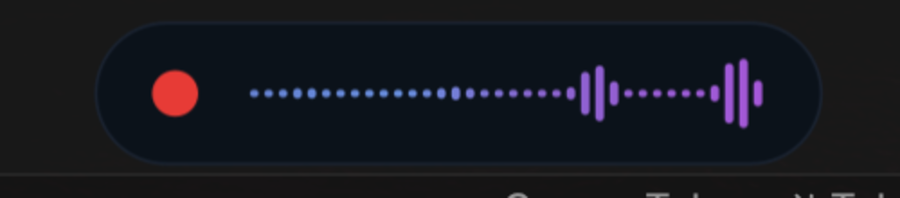
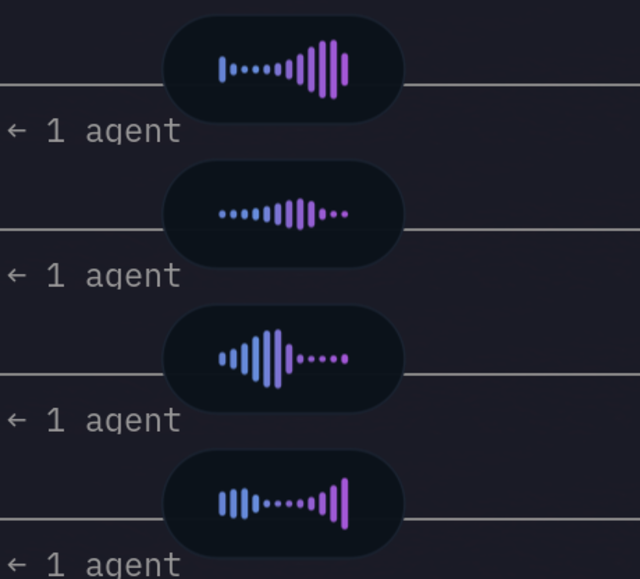
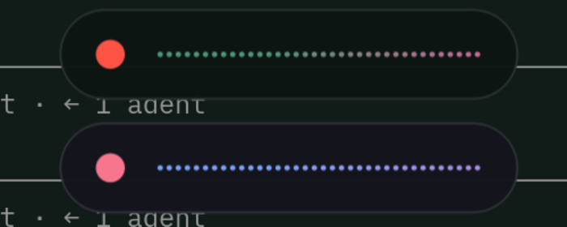

# voxtype-pill

A pill-shaped on-screen widget for [voxtype](https://voxtype.io), the
push-to-talk voice-to-text tool for Linux. It replaces voxtype's default
recording HUD with a compact pill that shows a red recording dot, a symmetric
blue-to-magenta waveform while you speak, and a traveling pulse while your
speech is being transcribed. Its colors follow your active Omarchy theme.



**Scope: visual only.** This is a voxtype OSD *style package*. It changes how
the widget looks and nothing else. Audio capture, transcription, hotkeys, and
your transcription engine are untouched. Installing it sets keys under the
`[osd]` section of your voxtype config and copies one QML file. No recompiling
voxtype, no daemon internals.

## Why it looks the way it does

- **Bottom pill, out of the way.** It sits in the same bottom band where
  volume and brightness OSDs appear, so it does not cover your work.
- **A live waveform, not a flat line.** Bars grow with your voice using a fast
  attack and a slow release, so they rise with energy and settle smoothly
  instead of jumping on every raw peak.
- **A transcribing animation.** When you release the key, the pill shrinks
  around the waveform and a synthetic pulse travels through it while voxtype
  turns your speech into text. On a slow machine the old frozen bars read as
  "still recording"; the pulse makes the transcribing state unmistakable.
- **Theme-aware colors.** The widget reads your active Omarchy theme and
  recolors itself the next time you dictate, with no restart. Off Omarchy it
  falls back to a fixed palette, so it still works anywhere voxtype does.

| Recording | Transcribing | Follows your theme |
|---|---|---|
|  |  |  |

## Requirements

- **voxtype**, installed and running. See https://voxtype.io (on Arch and
  Omarchy: the `voxtype-bin` AUR package).
- **quickshell** (the `qs` binary). The pill runs on voxtype's quickshell
  frontend. The default `gtk4` frontend cannot render custom styles, so the
  installer switches you to quickshell.
- **Omarchy** is optional. It is what makes the colors follow your theme. On
  any other setup the pill uses its built-in palette.

## Install

```bash
git clone https://github.com/cfvargas/voxtype-pill.git
cd voxtype-pill
./install.sh
```

Then hold your push-to-talk key and speak. The pill appears at the bottom of
the screen.

### What the installer does

1. Backs up your `~/.config/voxtype/config.toml` once, to
   `config.toml.voxtype-pill.bak`, so uninstall can restore it exactly.
2. Copies the style into `~/.config/voxtype/osd/pill/`.
3. Sets the `[osd]` keys for the pill with `voxtype config set`, which
   type-checks each value and preserves your comments and other settings.
4. Restarts the voxtype daemon so the frontend change takes effect. That
   reloads the transcription model, so it takes a few seconds.

## Configuration

Every setting is a standard voxtype `[osd]` key. Change any of them with
`voxtype config set <key> <value>`, then restart the daemon. The installer
applies these:

| Key | Value | What it does |
|---|---|---|
| `osd.frontend` | `quickshell` | Required. The frontend that can render the style. |
| `osd.style` | `pill` | Selects this style package. |
| `osd.palette` | `omarchy` | Lets colors follow the Omarchy theme. |
| `osd.position` | `bottom-center` | Horizontal anchor. |
| `osd.top_margin` | `0.90` | Vertical position, as a fraction of screen height. Higher is lower. |
| `osd.waveform_gain` | `10.0` | How strongly the bars react to your voice. |

**Tuning `waveform_gain`.** This is the one value worth tuning to your
microphone. If the bars slam to full height on normal speech, lower it. If
they barely move, raise it.

```bash
voxtype config set osd.waveform_gain 8.0
systemctl --user restart voxtype.service
```

## How the theming works

The widget reads the active Omarchy theme's `colors.toml` and maps four of its
colors: `red` for the recording dot, `dark_background` for the pill, and
`accent` and `magenta` for the two ends of the waveform gradient. Every color
falls back to a fixed value if the theme lacks it, so the pill always renders.

Colors reload on the next dictation after a theme change, with no restart. The
mechanism and why it needs care are documented in
[`docs/how-it-works.md`](docs/how-it-works.md).

## Uninstall

```bash
./uninstall.sh
```

It removes the style directory and restores the config backup taken at install
time, then restarts the daemon.

## How voxtype's OSD works

If you want to build your own style, or understand why this one is a QML
package rather than a config recipe, read
[`docs/how-it-works.md`](docs/how-it-works.md). It documents the quickshell
frontend, the style-package contract, and the runtime properties voxtype
injects into your QML.

## License

MIT. See [`LICENSE`](LICENSE).
